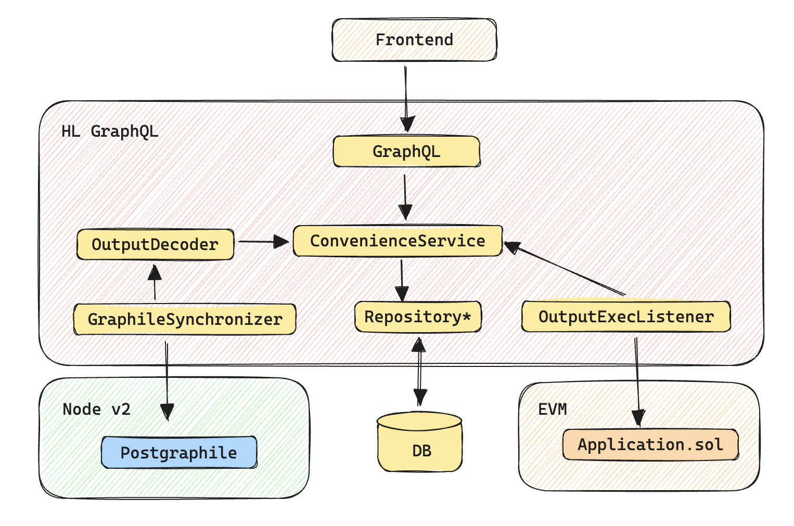

# Convenience

## **GraphileSynchronizer**
The **GraphileSynchronizer** manages the synchronization process with PostGraphile. It ensures that PostGraphile cursors are tracked and persisted, enabling the system to handle restarts and resume synchronization without data loss or inconsistency. This component is crucial for maintaining the continuity and reliability of the data synchronization process.

## **OutputDecoder**
The **OutputDecoder** is responsible for decoding the unified output generated by Node v2. It translates this output into specific entities such as vouchers or notices. Acting as an intermediary, this component interprets and transforms the raw output from Node v2 into meaningful, structured data that other components can process.

## **ConvenienceService**
The **ConvenienceService** is designed to enforce idempotency across the system, ensuring that operations are performed exactly once. It prevents data duplication by identifying and handling repeat operations, thereby maintaining data integrity and accuracy. This service serves as a safeguard against redundant data processing, which could otherwise lead to inconsistencies.

## **Repository**
The **Repository** component abstracts the underlying database interactions, allowing the system to switch seamlessly between different databases, such as SQLite or PostgreSQL. This abstraction provides flexibility and modularity, enabling developers to configure and deploy the application in various environments without altering the core logic.

## **OutputExecListener**
The **OutputExecListener** listens for output execution events emitted by the on-chain application contract. After detecting an event, it updates the `executed` flag in the database, indicating that the specific output has been successfully executed. This component plays a crucial role in tracking and logging the execution status of unified outputs, ensuring that the system maintains an accurate record of executed outputs.

## **GraphQL**
The **GraphQL** component is responsible for resolving queries within the GraphQL API. It serves as the interface through which clients can interact with the system, retrieving and manipulating data as needed. This component ensures that GraphQL operations are efficiently executed and that the API remains responsive and reliable.
